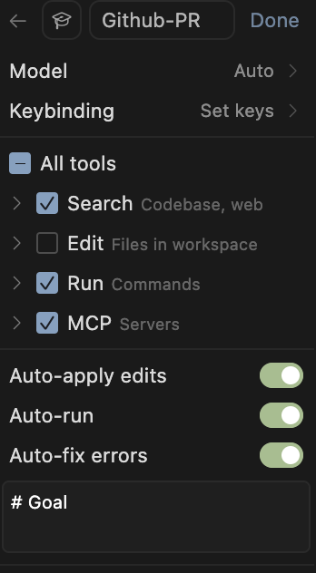

# Jira-GitHub Create PR Agent Configuration Guide

This guide explains how to configure an agent in Cursor that leverages two MCP servers (Jira & GitHub) to create a pull request, automatically filling its template with both code changes and Jira ticket data.

## Goal

The agent will:

- Extract the ticket number from the current branch (format: `feature/NUMBER`).
- Fetch ticket data from Jira using the pattern `PROJECT-NUMBER` (replace `PROJECT` as needed).
- Gather code changes from the current branch.
- Fill the pull request template and create a PR on GitHub.

## Prerequisites

- Access to [mcp-atlassian](https://github.com/sooperset/mcp-atlassian) and [github-mcp-server](https://github.com/github/github-mcp-server).
- A GitHub personal access token that is directly linked to your target organization (see configuration below).
- Personal access token for Jira (see configuration below).

## MCP Configuration Example

Below is a sample configuration for the MCP servers. **You must customize the tokens and organization-specific values.**

<details>
<summary>Show the ~/.cursor/mcp.json</summary>

```json
{
  "mcpServers": {
    "github": {
      "command": "docker",
      "args": [
        "run",
        "-i",
        "--rm",
        "-e",
        "GITHUB_PERSONAL_ACCESS_TOKEN",
        "ghcr.io/github/github-mcp-server"
      ],
      "env": {
        "GITHUB_PERSONAL_ACCESS_TOKEN": "YOUR_TOKEN"
      }
    },
    "mcp-atlassian": {
      "command": "docker",
      "args": [
        "run",
        "-i",
        "--rm",
        "-e", "CONFLUENCE_URL",
        "-e", "CONFLUENCE_USERNAME",
        "-e", "CONFLUENCE_API_TOKEN",
        "-e", "JIRA_URL",
        "-e", "JIRA_USERNAME",
        "-e", "JIRA_API_TOKEN",
        "ghcr.io/sooperset/mcp-atlassian:latest"
      ],
      "env": {
        "CONFLUENCE_URL": "https://YOUR-ORGANISATION.atlassian.net/wiki",
        "CONFLUENCE_USERNAME": "YOUR-NAME@YOUR-ORGANISATION.fr",
        "CONFLUENCE_API_TOKEN": "YOUR_TOKEN",
        "JIRA_URL": "https://YOUR-ORGANISATION.atlassian.net",
        "JIRA_USERNAME": "YOUR-NAME@YOUR-ORGANISATION.fr",
        "JIRA_API_TOKEN": "YOUR_TOKEN",
        "READ_ONLY_MODE": "true"
      }
    }
  }
}
```

> **Note:**
>
> - The `READ_ONLY_MODE` flag enables read-only access for Jira. Remove this flag if you need write access.
> - The Confluence configuration is present but not used by this agent.
> - Replace all `YOUR_TOKEN`, `YOUR-ORGANISATION`, and similar placeholders with your actual values.
>
</details>

## Adding the Agent in Cursor

To add and configure the agent in Cursor:

1. Open the agent creation panel in Cursor.
2. Fill in the agent name and select the appropriate model.
3. Enable the following tools:
   - Search (Codebase, web)
   - Run (Commands)
   - MCP (Servers)
4. **Make sure to enable "Auto-run"**. This ensures that actions are executed automatically without manual validation at each step, allowing the workflow to proceed smoothly.

Below is an example of the recommended configuration:



## Agent Prompt

<details>
<summary>Show the agent prompt</summary>

```md
# Goal

Fill a PR template with recent changes in the current branch and to create a PR with it.

# Rules

- Use `.github/pull_request_template.md` as the template.
- Read instructions from the template and fill it.
- Use the `git log` or `git diff` commands to get the recent changes IF NOT PROVIDED.
- Use the Atlassian mcp to get data about the Ticket on Jira.

# Steps

1. Get current branch name, project and repository.
2. Extract ticket number from branch name with format `feature/[NUMBER]`.
3. Get Jira data on the ticket using `FID-[NUMBER]` identifier from previous step.
4. Get current branch changes.
5. Get template and fill it.
6. Create a beautiful PR title.
7. Use filled template to create a PR.
8. Push it to GitHub using MCP asking for confirmation.
```

</details>

## Customization

- **Jira Project:**
  - The agent expects branch names in the format `feature/NUMBER`.
  - It will look for tickets in Jira using the pattern `PROJECT-NUMBER`. Replace `PROJECT` in the prompt and configuration with your actual Jira project key (e.g., `ABC-123`).
- **Tokens:**
  - Insert your GitHub and Jira tokens in the configuration above. These must have the necessary permissions for your organization.

## Pull Request Template

The agent relies on the `.github/pull_request_template.md` file to generate pull requests.

<details>
<summary>Show example pull request template</summary>

```
<!--
| This template must be filled out following the instructions in each section.
-->

# <!-- Instructions: fill with the PR title, should be short, but still descriptive -->

## ✅ Type of PR

<!--
Instructions:
- At least one of these must be checked.
- If you do not know which one to pick, pick "Feature".
- Base yourself on commit history.
-->

- [ ] Refactor
- [ ] Feature
- [ ] Bug Fix
- [ ] Optimization
- [ ] Documentation Update

## 📝 Description

<!--
Instructions:
- make the most concise description possible.
- focus on functional changes, not technical details.
- put important details here if necessary, in **bold**.
-->

## 🧍 Behavior

<!--
Instructions:
- Summarize the behavior changes in a few sentences.
- Use bullet points.
- Focus on the user experience.
- Be precise, not vague.
-->

## ✏️ Steps to test

<!--
Instructions:
- Give a list of steps to test the PR, using UI or not.
- Use checkboxes.
- Do not include installation process, focus on functional testing.
-->
```

</details>

## MCP Sources

- Atlassian MCP: [https://github.com/sooperset/mcp-atlassian](https://github.com/sooperset/mcp-atlassian)
- GitHub MCP: [https://github.com/github/github-mcp-server](https://github.com/github/github-mcp-server)
